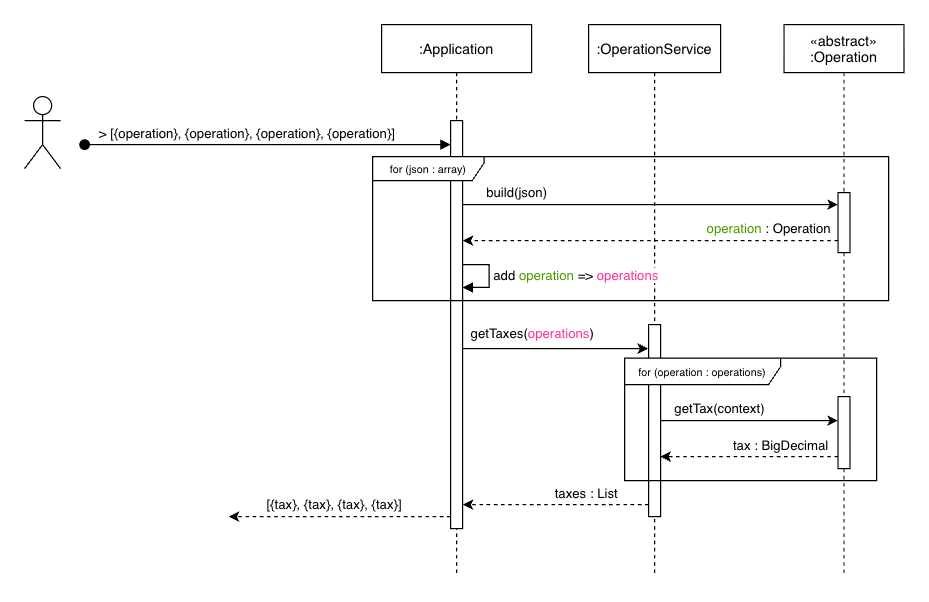

# Ganho de Capital

Programa de linha de comando (CLI) que calcula o imposto a ser pago sobre lucros ou prejuízos de operações no mercado financeiro de ações.

## Arquitetura



A lógica foi concentrada em três partes:

1. **CLI**: Responsável por receber o array de JSON, convertê-lo para objetos de operação e delegar o processamento para a camada de service.
2. **Service**: Serviço responsável por provê ações para manipulações das operações.
3. **Domain**: Contendo os tipos de operação (**BuyOperation** e **SellOperation**) e suas regras específicas, 
garantindo que toda a lógica de negócio permaneça isolada, independente da forma como os dados chegam. 
   1. **Context**: Responsável por armazenar estado das ações realizadas pela camada de dominio.

Foi utilizado **herança** para representar os tipos de operação. Ao diferenciar *buy* e *sell* como classes distintas,
a lógica se torna mais fácil de estender e mantém o código mais expressivo. Isso permite que o OperationService trate
cada operação de forma clara, sem condicionais. E é claro, facilitando a testabilidade unitária das ações responsável por aquela operação.

### Bibliotecas

- **Java 21 LTS**
- [**spock**](https://spockframework.org/): para realização de testes mais declarativos e humanamente mais fácil de ler.
- [**JSON-Java**](https://github.com/stleary/JSON-java): ultraleve parseador de JSON para facilitar a iteração com as entradas (stdin).

## Operações

As operações que a aplicação irá operar tem herança com a classe [Operation](src/main/java/br/com/weesftw/domain/Operation.java),
que possui responsabilidade de definir assinaturas comuns que toda operação irá precisar para realizar o calculo das
taxas de imposto de renda.

- Cada linha de operações inseridas na CLI, que contém a estrutura de *array json* válida, é feita a iteração através
  da chamada do método estático `Operation#build` para ser criada uma representação da operação.

```text
> [{"operation":"buy", "unit-cost":10.00, "quantity": 10000}, {"operation":"sell", "unit-cost":20.00, "quantity": 5000}]
```

- Multiplos *array json* podem ser inseridas pois, serão processadas individualmente.

```text
> [{"operation":"buy", "unit-cost":10.00, "quantity": 10000}, {"operation":"sell", "unit-cost":20.00, "quantity": 5000}]
> [{"operation":"buy", "unit-cost":20.00, "quantity": 10000}, {"operation":"sell", "unit-cost":10.00, "quantity": 5000}]
> [{"operation": "buy",  "unit-cost": 5000.00, "quantity": 10}, {"operation": "sell", "unit-cost": 4000.00, "quantity": 12}, {"operation": "buy",  "unit-cost": 15000.00, "quantity": 6}, {"operation": "sell", "unit-cost": 16000.00, "quantity": 3}, {"operation": "sell", "unit-cost": 60000.00, "quantity": 2}, {"operation": "sell", "unit-cost": 60000.00, "quantity": 3}]
```

- Dado o campo `"operation"` com valor inválido ou inesperado, os mesmos serão ignorados e não terão impacto durante o
  processamento das operações.

- A saída da aplicação resultará em um *array json* com a mesma quantidade de elemento(s) que a entrada porém, com a taxa calculada.

```text
> [{"operation":"buy", "unit-cost":10.00, "quantity": 10000}, {"operation":"sell", "unit-cost":20.00, "quantity": 5000}]
  [{"tax": 0.00}, {"tax": 10000.00}]
> [{"operation":"buy", "unit-cost":20.00, "quantity": 10000}, {"operation":"sell", "unit-cost":10.00, "quantity": 5000}]
  [{"tax": 0.00}, {"tax": 0.00}]
> [{"operation": "buy",  "unit-cost": 5000.00, "quantity": 10}, {"operation": "sell", "unit-cost": 4000.00, "quantity": 12}, {"operation": "buy",  "unit-cost": 15000.00, "quantity": 6}, {"operation": "sell", "unit-cost": 16000.00, "quantity": 3}, {"operation": "sell", "unit-cost": 60000.00, "quantity": 2}, {"operation": "sell", "unit-cost": 60000.00, "quantity": 3}]
  [{"tax": 0.00}, {"tax": 0.00}, {"tax": 0.00}, {"tax": 0.00}, {"tax": 16600.00}, {"tax": 9000.00}]
```

### Compras (buy)

Definições:

1. As taxas são sempre zeradas (0.00).
2. Calculos de valor médio ponderado:
   1. A primeira operação de compra deve receber o valor médio ponderado igual ao próprio custo unitário.
   2. As operações subsequentes devem fazer o recalculo considerando a **quantidade atual** de ações disponíveis.
3. Caso a **quantidade atual** de ações disponiveis estiver zerada (0), deve ser considerado o **valor médio ponderado**
   e a **quantidade** da operação que está sendo processada, sem a necessidade de realizar nenhum calculo.
4. Acrescentar a quantidade de ações que está sendo processada a quantidade atual disponivel.

> Classe responsável pelo processamento: [BuyOperation](src/main/java/br/com/weesftw/domain/BuyOperation.java)

### Vendas (sell)

Definições:

1. As vendas devem fazer subtração do estoque atual de ações disponiveis.
   1. Caso tentar realizar com o estoque zerado (0), será retornado a taxa zerada (0.00) para aquela operação.
   2. O estoque atual de ações disponiveis poderá conter apenas valores **positivo** ou **zero**.
2. Prejuizos:
   1. Poderá conter apenas valores **negativo** ou **zero**.
   2. As taxas são sempre zeradas (0.00) 
3. Lucros:
   1. Se o valor da venda total (custo unitário * quantidade) for menor ou igual ao limite de isenção (R$ 20000.00),
   a operação não entra na matemática do imposto de renda e **não** deve ser utilizado no abatimento dos prejuizos e nem taxado.
   2. Caso tenha prejuizo acumulados, devem ser abatidos primeiro e depois, ser calculado a taxa em cima do lucro.

> Classe responsável pelo processamento: [SellOperation](src/main/java/br/com/weesftw/domain/SellOperation.java)

## Execução

### Testes

Na raiz do projeto, é possível acompanhar a execução dos [testes](src/test/groovy/br/com/weesftw) (**unitários** e de **integração**) através do terminal
executando o seguinte comando:

```shell
./mvnw clean test
```

### Aplicação

Na raiz do projeto, para executar a aplicação através do terminal (CLI), utilize o seguinte comando:

```shell
./mvnw clean package exec:java
```

A saída no terminal terminará com a seguinte **[INFO]**:

```shell
[INFO] --- exec:3.1.0:java (default-cli) @ capital-gains ---
```

A partir disso, a aplicação já estará apta a receber o *json array* com as operações a serem processadas.

> Caso possua algum arquivo `.txt` com operações a serem processadas, utilize o seguinte comando:
>
> ```shell
> ./mvnw clean package exec:java < /path/file.txt
> ```

#### Build conteinerizado

Na raiz do projeto e com a instancia do Docker rodando, para construir a imagem através de um container, utilize o seguinte comando:

```shell
./mvnw clean compile jib:dockerBuild
```

> O nome da imagem será gerado como: **weesftw/capital-gains-java:latest**

Para executar:

```shell
docker run -it weesftw/capital-gains-java:latest
```

Caso queira executar a leitura de um arquivo através do container:

```shell
docker run -i weesftw/capital-gains-java:latest < /path/file.txt
```